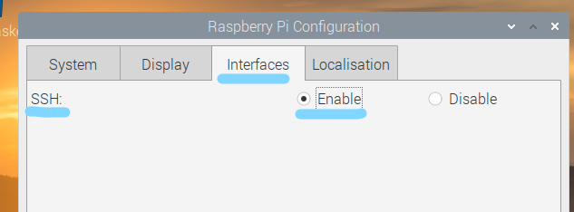

# README

Raspberry Pi でフォルダ内の動画を起動時ランダムに選びループ再生するスクリプト。

---

```bash
curl https://raw.githubusercontent.com/Sachi854/play-video/main/init.sh | bash
```

自動再生・samba のデーモンが起動。

# RasPi の設定

RasPi への OS インストールや初期設定は済んでいるものとする。

追加の設定として、設定 -> Raspberry Pi の設定を開く。


ディスプレイ設定のスクリーンセーバーを無効化。


インタフェース設定の SSH を有効化。



適用する。


再起動を求められたら行う。


完了。

# インストール

RasPi を起動しターミナルを起動。


ターミナルを起動したら次のコマンドを入力しエンターをおす。途中でログイン時のパスワードを求められるこがある。その際は入力すること。

OS や付属ソフトのアップデート処理も行う為かなり時間がかかる。

```bash
curl https://raw.githubusercontent.com/Sachi854/play-video/main/init.sh | bash
```


処理中に次の画面が出る。左方向キーで Yes を選択しエンターをおす。


ディレクトリマークをクリック。


``playlist`` ディレクトリを開く。


ブラウザを開き Google Drive や Dropbox 等から
動画をダウンロードし配置するのが簡単。


いらないデモ用の ``a.mp4, b.mp4, c.mp4`` は削除する。

配置後、RasPi を再起動する。

再起動終了後、動画がループ再生される。


# 再生する動画を変更する

初めに RasPi と同一のネットワーク(同じ Wifi・LAN ケーブルで PC に直接繋ぐ)に接続する。

次の作業は OS により異なるので以下を確認すること。

Windows OS の場合

- [Windows 10 でネットワーク ドライブを割り当てる](https://support.microsoft.com/ja-jp/windows/windows-10-%E3%81%A7%E3%83%8D%E3%83%83%E3%83%88%E3%83%AF%E3%83%BC%E3%82%AF-%E3%83%89%E3%83%A9%E3%82%A4%E3%83%96%E3%82%92%E5%89%B2%E3%82%8A%E5%BD%93%E3%81%A6%E3%82%8B-29ce55d1-34e3-a7e2-4801-131475f9557d)

``\\raspberrypi\pi`` を指定する。

Mac OS の場合

- [Macを共有コンピュータおよびサーバへ接続する](https://support.apple.com/ja-jp/guide/mac-help/mchlp1140/mac)

どちらもホスト名を raspberrypi またディレクトリは pi とし接続。

接続先のディレクトリ直下に必要な動画ファイルを配置、もしくは削除。

配置後、RasPi の電源を物理的に落とし再起動。
