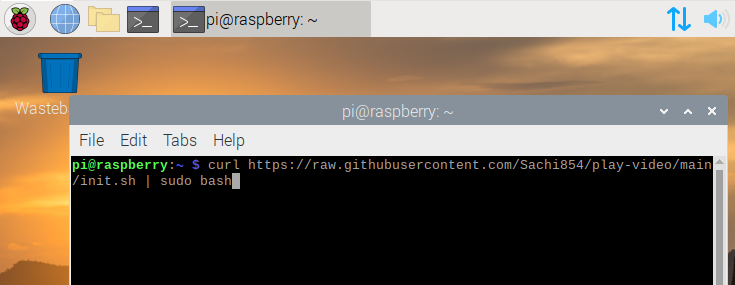

# README

ラズパイでフォルダ内の動画をループ再生するスクリプト。

# インストール

ラズベリーパイを起動しターミナルを起動。


ターミナルを起動したら次のコマンドを入力しエンターをおす。途中でログイン時のパスワードを求められるこがある。その際は入力すること。

```bash
curl https://raw.githubusercontent.com/Sachi854/play-video/main/init.sh | sudo bash
```



# 使い方

ファイルマークをクリック。


``playlist`` ディレクトリを開く。


目的の動画ファイルを配置する。


配置後、ラズベリーパイを再起動する。

